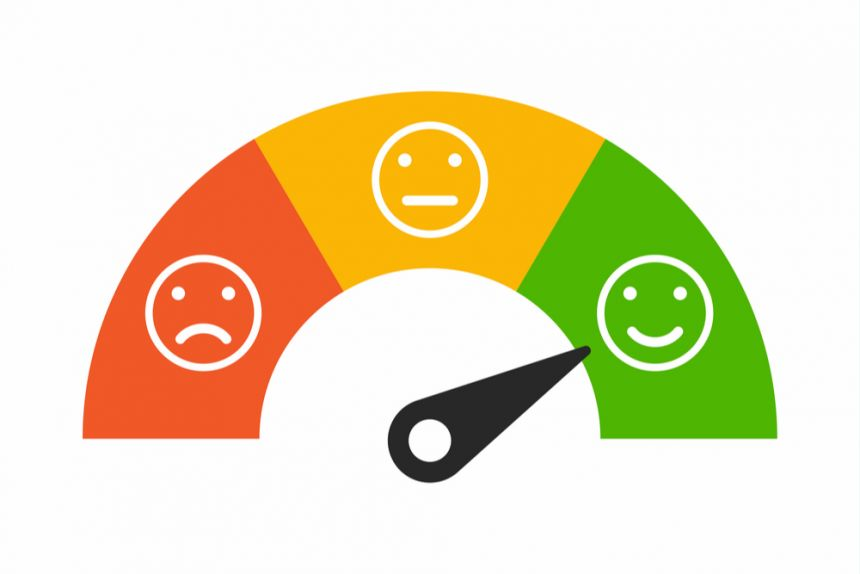

  

# Proyecto de Ciencia de Datos: **Film Junky Union: Clasificación de Sentimiento** 🎬

## Descripción
En este proyecto, desarrollamos un sistema para filtrar y categorizar reseñas de películas mediante técnicas de procesamiento de lenguaje natural (NLP). El objetivo principal fue clasificar automáticamente las reseñas de películas en diferentes categorías, como "Positiva", "Negativa" o "Neutral". Utilizamos un conjunto de datos de reseñas de películas y entrenamos un modelo de clasificación para predecir el sentimiento de cada reseña.

## Tecnologías Utilizadas
- **Python**
- **Pandas**
- **Scikit-learn**
- **NLP (Natural Language Processing)**

## Análisis Visual de Datos
A continuación, se presentan algunas visualizaciones importantes del análisis de los datos:

1. **Distribución de Sentimientos en el Conjunto de Datos**
   - Esta visualización muestra cómo se distribuyen las reseñas entre las categorías de sentimiento. Nos ayuda a entender si hay un desbalance entre las clases, lo cual es importante para elegir el modelo y técnicas de balanceo adecuadas.

   
   
2. **Palabras Más Comunes en Reseñas Positivas y Negativas**
   - Un gráfico de nubes de palabras que muestra las palabras más frecuentes en reseñas positivas y negativas. Este análisis visual puede ayudarnos a identificar qué términos son indicativos de un sentimiento positivo o negativo.

   

## Conclusiones
Este proyecto proporcionó una visión profunda sobre cómo las reseñas de películas pueden clasificarse según su sentimiento. Se emplearon varias técnicas de procesamiento de lenguaje natural y machine learning para crear un modelo que automatiza la clasificación de las reseñas con una alta precisión. 

## Próximos Pasos
En el futuro, se podrían explorar métodos más avanzados de NLP, como el uso de modelos de deep learning (Redes Neuronales), para mejorar la precisión de la clasificación y la comprensión semántica de las reseñas.

